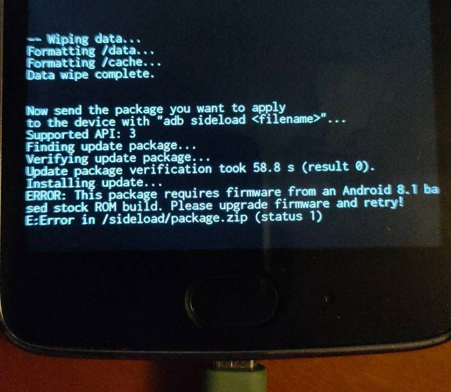

# The old smartphone
In August 2017 I bought a [Motorola Moto G5](https://www.gsmarena.com/motorola_moto_g5-8454.php).
I used it daily for almost 3 years before switching to a new phone.
There were a few reasons for this.
In terms of hardware: the screen size was smaller than I would like, storage space was limited for all the apps and pictures, and battery life became annoyingly short by lasting just less than one day.

However the decisive factor for the change was not on the hardware shortcomings.
It was the reason I suspect most people have when buying new phones but are ashamed of admitting.
The phone felt old.
There were no new Android updates anymore, everyone around me had the new and shiny Android release but I was stuck on version 8.1.
Furthermore the last security update was on the 1st February 2019, less than 2 years after the phone was released.
What happens after that is security vulnerabilities pilling up.
Every month there are new ways someone can mess with my phone and it never gets better, it is kind of scary.
Using the phone started to feel like handling a dangerous piece of abandoned ancient technology.

If I wanted to keep using the phone, I would have to fix its problems.
Regarding hardware, apart from getting a new battery, changing the screen size is not possible and increasing storage space sounds too complex for me.
But I could live with such limitations. 
Besides, buying a new battery is easy enough.

What I didn't know at the time, was that fixing the real problem: old software, did have a practical solution: LineageOS.

# LineageOS
[LineageOS](https://lineageos.org/) is a free and open-source Android distribution. 
It focuses on security and longevity and aims to provide a normal Android experience with regular security updates and more customization.
This means that I could replace my phone's stock OS with LineageOS and enjoy the benefits of a continually updated phone.
And because it is still android I can keep using all the apps I use normally.
At the time I am writing this, the project already supports [more than 160 devices](https://wiki.lineageos.org/devices/) from over 20 vendors. 
One of such devices being my old smartphone.

# Installing LineageOS
Installing LineageOS was surprisingly easy and straightforward. 
Apart from one problem in the very beginning, I followed the [official instructions](https://wiki.lineageos.org/devices/cedric/install) on the website and things just worked.

One of the requirements to install the OS was to "ensure that the device is currently using Android 8.1 firmware.".
When I looked in the settings to check the software version, it clearly stated "Android 8.1".
And when I tried to update the software anyway I got a message saying that the phone was fully updated.
However during the installation I ran into an error telling me I didn't have firmware from Android 8.1.

The error looked like this:

The problem here was that the phone's modem firmware wasn't fully updated. To fix that I had to manually do it, following the posts from this [forum page](https://forum.xda-developers.com/t/rom-official-cedric-11-lineageos-18-1.4260293/page-9#post-86440735).
After fixing the modem version, the installation worked as expected.

# The "new" old smartphone

Before installing LineageOS, the phone was kept in a drawer for more than 2 years and I never considered using it again.

Now 3 months have passed since then and it really feels like I have a new phone. 
So much so that I use it almost daily as my work phone now.